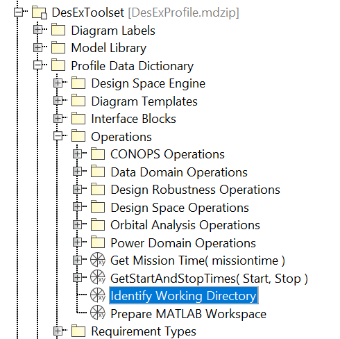
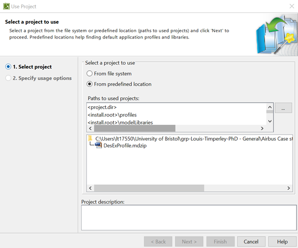

# DesEx Toolset
This toolset is intended to provide design space exploration capabilities for the spacecraft domain when using MBSE. 
Its use is further detailed in its companion paper, available here: https://ieeexplore.ieee.org/document/10116019
## MBSE Environment
The toolset is designed for SysML and to be used with Cameo Systems Modeller (now called Magic Sytems of Sytems Architect). MATLAB is necessary for storing 
and visualising design space data and STK provides orbital co-simulation.
## Components
The toolset contains a template project, including a profile of stereotypes for parameter variability modelling, workflow 
diagrams for executing design space explorations and MATLAB based interface for co-simulation in STK.

## Example Models and Demonstrations
Demonstrations of the toolset capabilities may be found in the examples folder and include:
 -  A very simple parametric model of the Rastrigin Function in 2 dimensions complete with design space exploration implemented for two design variables and one design constraint
 - A simple Earth observation spacecraft model with orbital predictions (supplied by STK) and design space exploration of orbital parameters

## Setup
### Requirements
To use the full capabilities of the toolset the following is required:
- MATLAB license
- MATLAB Global Optimization Toolbox link:https://uk.mathworks.com/products/global-optimization.html
- STK license

The toolset may still be used without some of these, but certain aspects will not work -> no orbital co-simulation without an STK license and no genetic optimisation without the MATLAB Global Optimization Toolbox. It may be possible however to find alternatives to these and adapt then, e.g. GMAT for STK and PyGAD as a python alternative to the MALTAB optimisation toolbox.


### 1. Update Working Directory
 - Update the working location of the Des-Ex toolset by opening the project located at cameo-resources\DesExTemplate\DesExProfile.mdzip in your copy of repository.
 - Some warnings will appear at this point, but can be ignored
 - Edit the "Identify Working Directory" Opaque Behaviour located at 'DesExToolset/Profile Data Dictionary/Operations/' Identify Working Directory' on the containment tree. See below:

 

 - Edit the 'Body and Language' of the behaviour so that the global variable 'GLOBAL_ALH_Enhancements_Path' points to your copy of the ALHenhance.js file in the repository

```
 ALH.setGlobalVariable("GLOBAL_ALH_Enhancements_Path", "PATH/TO/YOUR/REPO/ALHenhance.js");
```
 - Save the project and close it
 - Now whenever the toolset is used it will be able to correctly find its additional javascript functions


### 2. Integraiton with MATLAB
 - The steps for integrating Cameo/ Magic Systems of System Architect (MSOSA) with MATLAB can be found here: https://docs.nomagic.com/display/CST185/Integration+with+MATLAB

### 3. Import Des-Ex Toolset
 - When starting a new project it is necessary to import the Des-Ex toolset project. to import the toolset project from the cameo-resources directory click File, Use Project, Use Local Project and the following will appear

 

- Add the path to your cameo-resources directory to the locations list and select the DesExProfile.mdzip project. On the next page, load the project in read-only mode to improve performance, unless you wish to edit the toolset itself.

- you will now see the DesExToolset package in the containment tree

### 4. Import Workflow Diagram Type 
- To import the new workflow diagram type, click the Diagrams menu and Customize Diagrams.
- Then click import and select the Workflow descriptor.xml file from the cameo-reasources directory.

Your setup is now complete.

## First Project With the Toolset and Setting up a Design Space Exploration
For an initial introduction to the toolset, read the file [getting_started.md](docs/getting_started.md) in the docs directory.

## Further Sample Model and the STK interface
For more explanation of the STK interface and a more complex example mode, read the file [further_example.md](docs/further_example.md) in the docs directory.

# Code documentation
Most of the code in this repository has docstrings related to it that should provide some understanding of the different components. The Code is spread between several locations. the +design_space and +stk_interface directories provide MATLAB classes for handling the design space exploration and STK interface respectively. The ALHenhance.js file provides additional javascript functions used across the toolset and there are many opaque behaviours included in the Des-Ex toolset project itself under profile Data Dictionary/Operations in the containment tree.

# Citation
If you use this code/toolset, we kindly request that you cite our research, you may use the following BibTex entry or equivalent:

```
@INPROCEEDINGS{10116019,
  author={Timperley, Louis and Berthoud, Lucy and Snider, Chris and Tryfonas, Theo and Prezzavento, Antonio and Palmer, Kyle},
  booktitle={2023 IEEE Aerospace Conference}, 
  title={Towards Improving the Design Space Exploration Process Using Generative Design With MBSE}, 
  year={2023},
  volume={},
  number={},
  pages={1-20},
  doi={10.1109/AERO55745.2023.10116019}}
```
# License
This project is licensed under the Apache Commons License 2.0 - see the LICENSE.html file for details