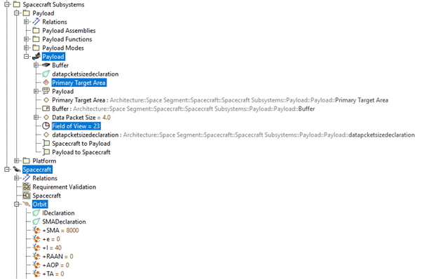
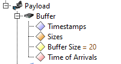

# Further Sample Model and the STK interface
A more complex example model is provided in the EarthObservationSatellite project in the examples directory of the repo. This includes a basic satellite modelled with a payload and generic spacecraft platform as subsystems. The modelling approach taken for this example loosely follows the Spacecraft Early Analysis Model presented in https://research-information.bris.ac.uk/en/studentTheses/a-model-based-framework-for-early-stage-analysis-of-spacecraft. 

For a more basic introduction to the toolset, read the file [getting_started.md](getting_started.md).

## STK Ingested Elements
The toolset includes a set of stereotypes used to identify model elements related to the mission orbit and aspects to be included in the STK scenario. The 'Orbital Analysis Initialization' workflow is used to extract these elements and the 'Run  STK Orbital Model' workflow loads all this information into an STK scenario and executes this STK model. By using the Mission time operations, located at 'Model data Dictionary/Operations' in the toolset, both the mission time variable in the cameo model and the mission time in the STK model can be propagated, ensuring a closely coupled co-simulation between cameo and STK.

The information that can be captured by the STK interface is therefore as follows:
- Spacecraft
    - Name
    - Orbital elements (Keplerian)
    - Payload
        - Name
        - Payload
        - Pointing offset Direction (Elevation/Azimuth)
        - Pointing Type (NadirFixed,Fixed,Targeted)
        - Field of View Type (Conical or rectangular)
        - Field of View (Conical angle or rectangular x and y angles)
        - Target
            - Name
            - Target Type (AreaTarget {with a shapefile},Earth,Lunar,Sun)
            - Sunlight constraint (true/false)
            - Solar Zenith Angle Constraint(true/false)

The image below shows how these appear in the containment tree (the rest are stored as tag values of their related element, e.g. payload). The MATLAB class files under the +STK_interface directory further details how this information is loaded into STK and the STK API documentation is available at: https://help.agi.com/stkdevkit/index.htm

## Data Domain Analysis
To facilitate analysis of the flow of payload generated data across a spacecraft system a further set of stereotypes were implemented in the toolset. Any logical element in the system that would handle data at some point in the mission was given a "Buffer" block (with the 'Data Packet Buffer' stereotype available in the toolset). By generating "data packets" (using the Generate Data Packet operation, located at 'Model data Dictionary/Operations' in the toolset) in a payload buffer when performing an observation and sending these data packets around various data buffers (using the Send Data Packet operation, located at 'Model data Dictionary/Operations' in the toolset) until they were downlinked to a ground station's data buffer, the precise flow of data and data latency could be modelled.

To capture this information each buffer included four properties:
- Timestamps: a list of each data packet's time of creation
- Sizes: a list of each data packet's size (e.g. in MB)
- Buffer Size: the size of the data buffer (e.g. in MB)
- Time of Arrivals: a list of each data packet's time of arrival to the current data buffer

The image below shows an example of such a buffer belonging to the payload in the example model:

Finally the 'Plot Domain Analysis Profiles' workflow available in the toolset can be used to plot the amount of data in each buffer in the system and track data latency through time.
