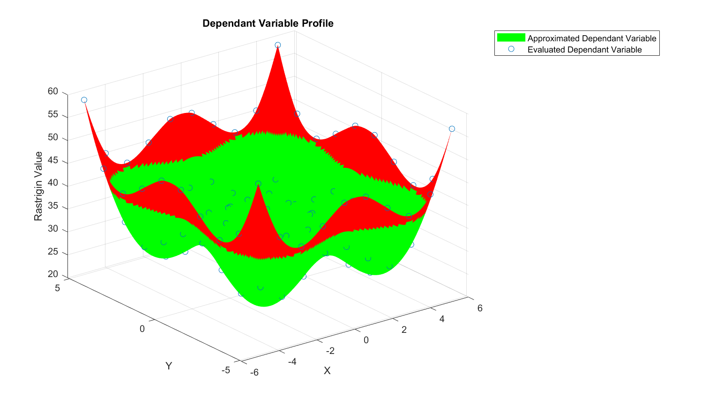

# First Project With the Toolset and Setting up a Design Space Exploration
To get an idea of how to the use the toolset, open up the the RastagrinSample project in cameo, under the examples directory and save a new copy somewhere convenient for you. This model provides a simple example, with a single parametric (though implmented in an activity diagram NOT parametric diagram) that follows the widely used Rastrigin function. More details on this can be found in the companion paper: https://ieeexplore.ieee.org/document/10116019 

You will see the containment tree looks something like this (toolset highlighted):

 

## Model Structure
open the 'model' block definition diagram at the top level of the containment tree to see the overall structrue of the sample model:

 

In this diagram you can see the 'Sample Rastigin Model' block, this hase been setup with three value porpeties, X, Y and Rastrigin Value. It has been setup with an activity to update the Rastrigin Value based on the two inputs, X and Y. This activity is executed for each design when a system simulation is run, see the activity diagram:

 

The declarations used to define objectives, dependant variables and design variables can also be seen at the bottom of the model BDD. These are further detailed in the next section.

## Design Space Exploration Setup
to see how the exploration has been setup, navigate to the Sample Rastrigin Model block in the containment tree.


By opening the specifications of each of the Rastrigin Declaration (a dependant variable declaration stereotype, availabe in the toolset), Rastrigin obj Declaration (an objective declaration, availabe in the toolset) and both X and Y declarations (design variable declarations,availabe in the toolset), you will be able to see the details of the design space exploration setup. For more information on how these should be used to construct a desing space exploraiton, consult the companion paper: https://ieeexplore.ieee.org/document/10116019.
The image below shows the tag values of the X Declaration (one of the two design variables):


The tag values towards the bottom are the important ones. 

- The Design Variable maximum and minimum entries define the range of over which to evaluate designs. 

- The enable design variable tickbox can be used to make this particular design variable active in the epxloration or inactive. 

- The Number of Design Variable Collection points controls how manay values of this design variable to create designs at. 

- The Variable Name entry is the name of the actual variable itself (e.g. value propetiry or generic property) that is to be varied. This approach of using a separated declaration block is a result of limitaitons with cameo's javascript API. It is hoped that in future versions the separate declaration could be merged with each variable for simplicity.

- Finally the Design variable Type currently has no impact and can be left as 'continuous'

The specification of the Rastrigin declaration (a dependant variable) looks like this:


It is simpler than the design variable declaration. The enable tickbox can similarly b used to activate or deactivate the dependant variable and the variable name entry defines the name of the depandat variable itself (e.g. value propetiry or generic property)

To apply a constraint to this dependant variable, a parametric diagarm is used along with a constraint with 'desingSpaceConstraint' stereotype (available in the toolset) applied.


The specificaiton of the design Space Constraint is thus:


The constraint Type has been set to 'Requirement Max Constriant', available in the toolset located at Profile Data Dictionary/Requirement Types. Therefore by setting the value of the 'Max Allowable Value' seen in the parametric diagram to 40, the allowable designs are constrained in the design space exploration to ones where the rastrigin value is less than 40. Minimum limits and ranges can be set as constraints on dependant variables in a similar way using the resepctive constraint types available in the toolset.

The image below shows where the max allowable value, design space constraint and dependant variable declaration appear in the containment tree:


Finally the Rastrigin obj declaration looks like:


The only new entry here, Weight provides the weight to assign to this objective. In multi-objective exploration cases this can be used to give different priorities to each objective. Positive weights will be minimised in optimisation and negative ones will be maximised.

## Design Space Exploration Execution
Before executing a design space exploraiton you need to make sure that the MATLAB interpreter is using the right working directory.
- The easiest way of doing this is to open MATLAB, then change the "current folder" (or working directory) usuall visible on the left to the root direcotry of your copy of the repository
- Then enter the following command into the MALTB command window:
```
matlab.engine.shareEngine
```
- This will mean the MATLAB enigne related to this MATLB command window will be shared with cameo when executing the design space exploration, ensuring the correct working directory and allowing you to monitor the MATLAB variables during the exploration.

Now open the MBSE Machine Activity diagram to see the main steps of the design space exploration. This diagram will be executed when a simulation is run (using either the explorationanimated or explorationsilent simulation configs located in the simulation package in the model).


- The first step simply allows the toolset to identify where to find its extra javascript functions. This step has been taken direclty from the toolset available operations (found at 'DesExToolset/Profile Data Dictionary/Operations/' in the containment tree)
- The second step 'Prepare MATLAB Workspace' clears any existing MALTAB variables and intialises some new variables needed for the design exploration process.This step has been taken direclty from the toolset available operations (found at 'DesExToolset/Profile Data Dictionary/Operations/' in the containment tree)
- The 'Save Model Instance' step saves the baseline design and model condition that will be returned to for each new design. This is useful in more complex simulaitons where the model may be in a signifcantly different condition at the end of any analysis performed.This step has been taken direclty from the toolset available operations (found at 'DesExToolset/Profile Data Dictionary/Operations/' in the containment tree)
- The 'Rastrigin Test Case' initialises the Rastrigin Value property in the model to a correct intial value.
- The 'Design Space Initialisation' step collects all the design space declarations (e.g. design variables) and sets up MATLAB varaibles to control the design space exploration. This step has been taken direclty from the toolset available workflow templates (found at 'DesExToolset/Profile Data Dictionary/Workflows/' in the containment tree)
- The 'Desgin Space Exploration EDITED' step is an edited version of the Desgin Space Exploration workflow available in the toolset. This workflow has been copied and edited to include the relevant squence of analysis for this sample project. The orignial Desgin Space Exploration workflow included in the toolset is intended only as a template that must be edited in this way for each design space exploration.

Open the 'Desgin Space Exploration EDITED' workflow to see its contents:


The diagram contains the main loop that steps through each different design defined by the design variable declarations

The only step that needs to edited to be relevant to each design space exploration is the 'Design Point Analysis Sequence'. This is the step that should be used to perform any nessecary design analysis to update the dependant and objective variables to correspond with each set of design variables values. For this case, this step is as shown below:


This diagram simply takes the X Y values as input and updates the value of the Rastrigin Value variable accordingly using the 'Rastrigin Analysis' opaque behaviour located at 'Model data Dictionary/Operations' on the containment tree.

Continuing with the steps shown in the MBSE Machine Activity diagram, the last few steps are all workflows taken directly form the toolset that:
-  firslty builds a surrogate model from the design data collected during the 'Desgin Space Exploration EDITED' step then optimises it using a MATLAB genetic optimsiaiton algorithm, see here: https://uk.mathworks.com/discovery/genetic-algorithm.html. These are implemented using two workflows (surrogate model creation and genetic optimisation) available in the toolset.
- Then the 'Display Design Space' step generates a set of MATLAB figures showing all the information collected about the design space.
- Finally the 'Save Design Alternatives Data' steps saves the desing space information (in the form of a .m file for the MATLAB workspace) for later use and analysis.

Below are the set of plots generated during the design space exploration, with 10 values tested for each design variable. Grean regions are feasible, and red violate the design space constraint

- The Rastrigin dependant variable profile:


- And the design space itself (showing the normalised objective fucntion of the Rastrigin value)


## Futher Example
For more explanation of the STK interface and a more complex example mode, read the file [further_example.md](further_example.md).